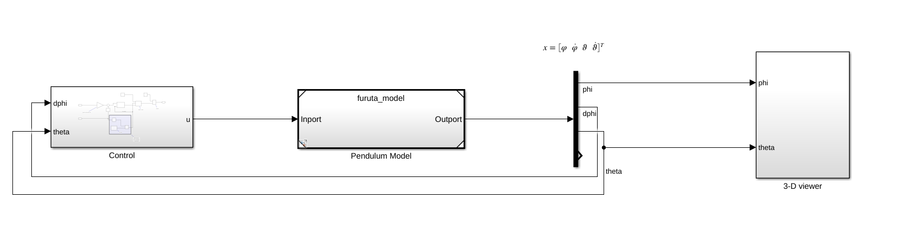
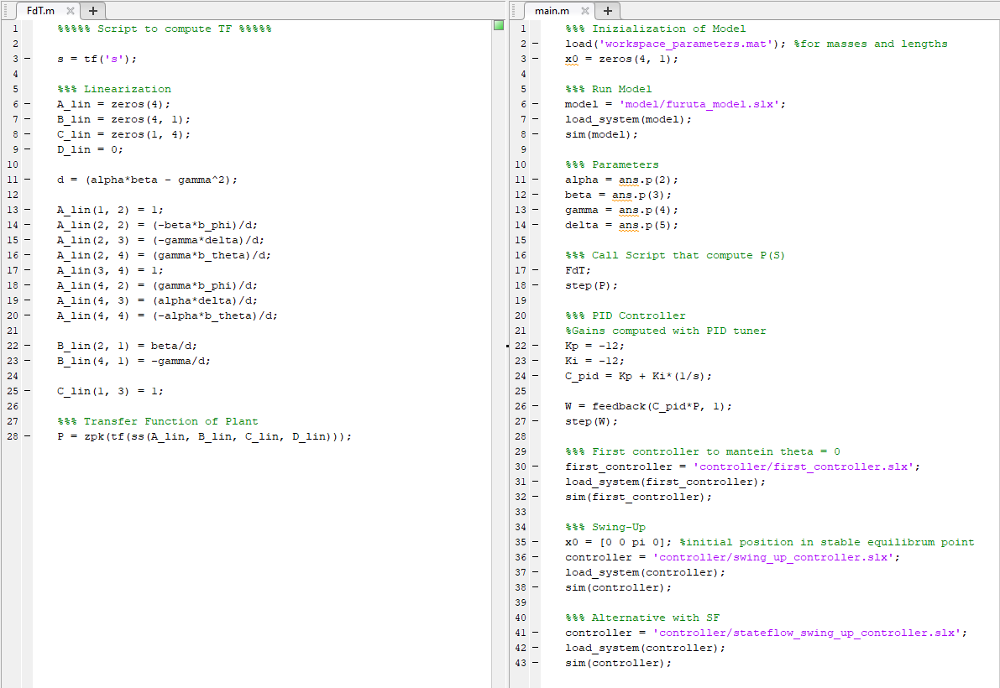
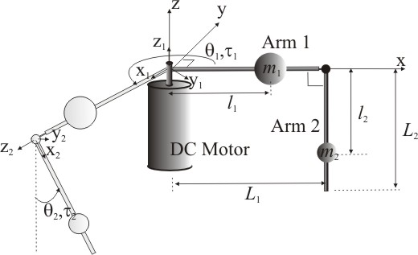
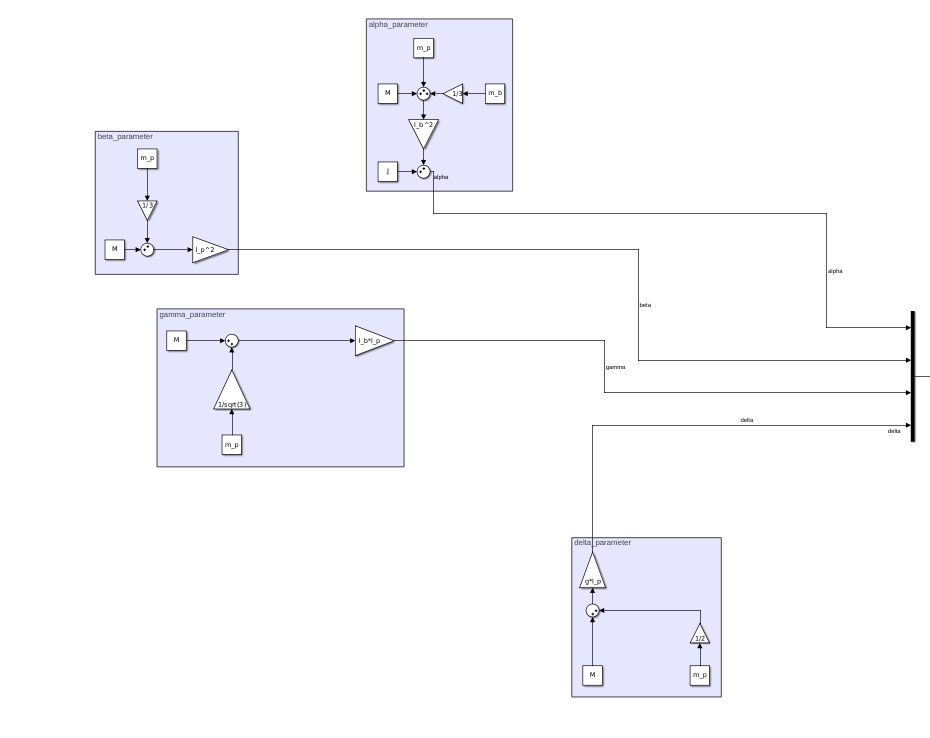
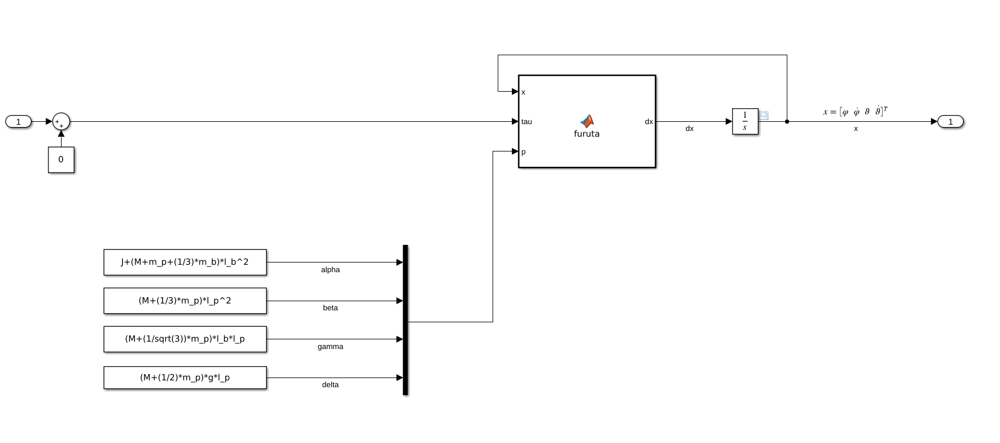
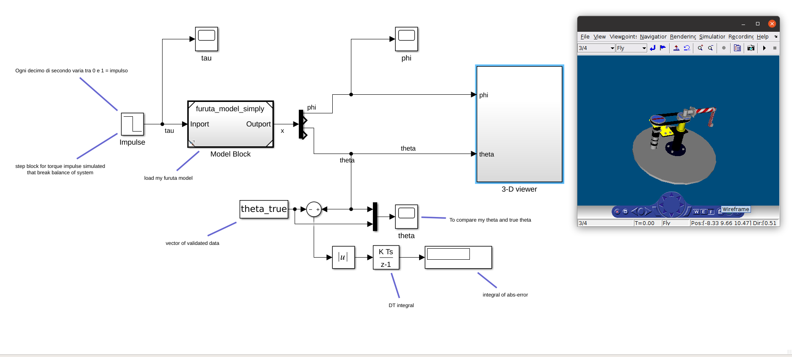
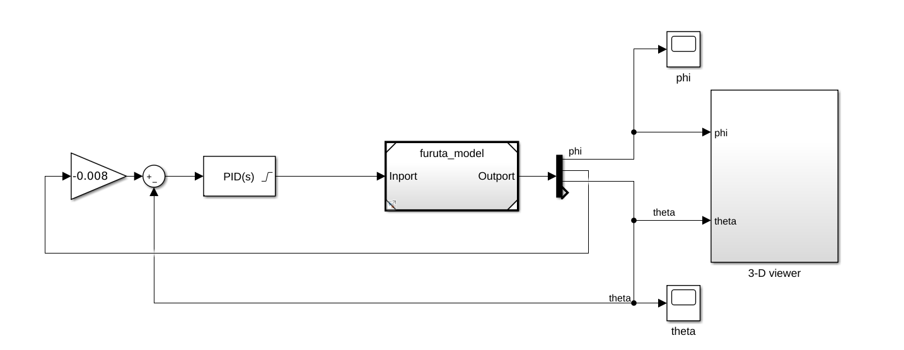
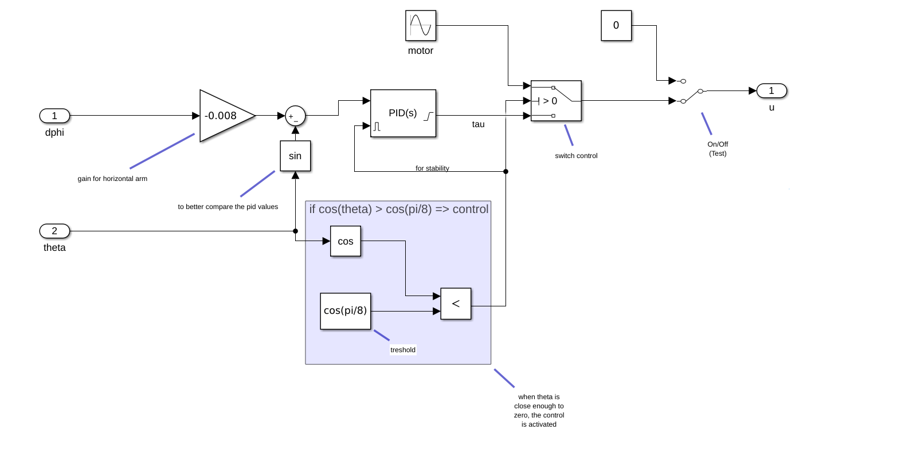
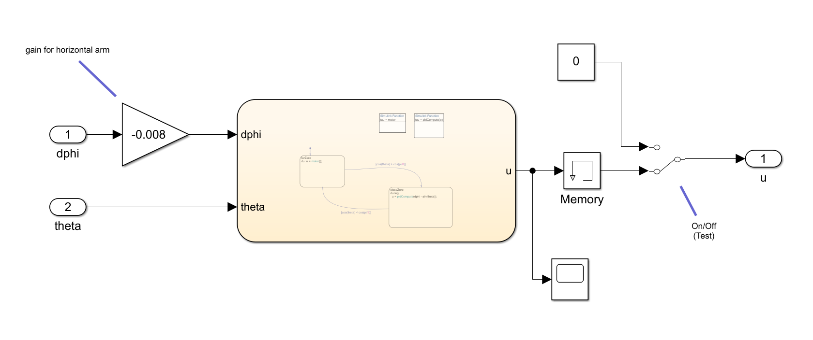
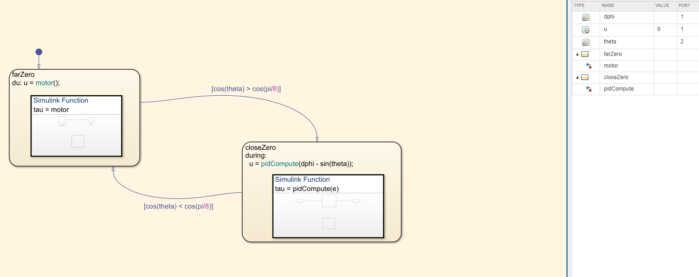

# Furuta Pendulum
Modeling and controller for Furuta Pendulum with <a href ='https://it.mathworks.com/?s_tid=gn_logo'>Simulink, Matlab R2020a and Stateflow</a>.

## Main for complete system

  
  

## System description
To compute the mathematical model of the pendulum, we refer to the figure below

  

## Parameters of model
The parameters measured in laboratory are:
- pendulum mass m_p = 0.3 kg
- pendulum length l_p = 0.205 m
- brace mass m_b = 1 kg
- brace length l_b = 0.3 m
- puntiform mass M = 1 kg
- inertial moment J = 0.1531 kg*m^2
- gravity g = 9.81 m*s^-2

For constant transduction:
- torque drive constant k = 2.7 Nm/V
- transduction drive constant k_i = 2.667 A/V
- gearbox transmission ratio k_g = 15
- motor torque constant k_t = 0.1 Nm/A

For frictions:
- viscous friction on brace b_phi = 0.337 Nms/rad
- viscous friction on brace p_theta = 0.035 Nms/rad

This parameters are declared in callbacks of simulink model.

## Motion Equations
We use second species Lagrange equations

obtain the following dynamic model

with

implemented as

  

## Explicit angles

the model obtained is

  

## State Simulation
Use model "furuta_check" to verify the correctness with measurements made in laboratory.

  

## Transfer Function
Linearizing around null theta angle, obtain follow function transfer,

  

## PID controller
Utilizing the PID-Tuner obtain follow PID controller

  

and the firs controller to mantein null theta angle

## Swing-Up
For Swing-Up problem, the idea has been that of to introduce a wave signal for motor and a control for monitoring theta angle.  

using stateflow, implement an alternative mode of swing-up controller

